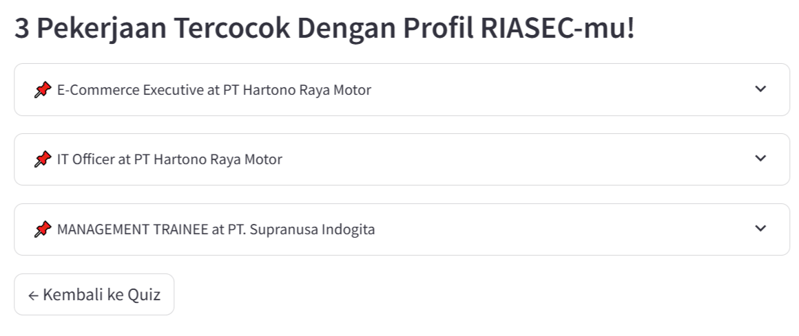
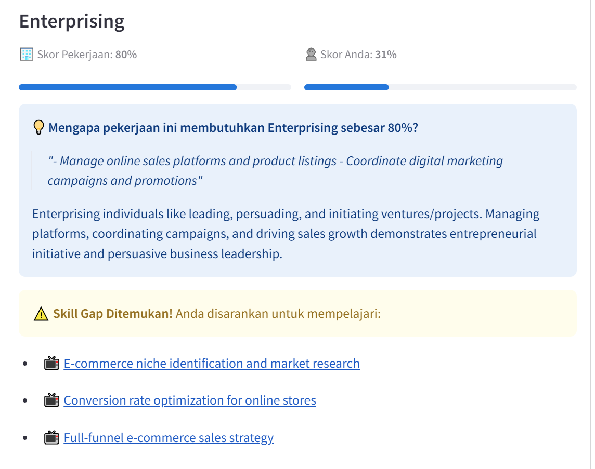
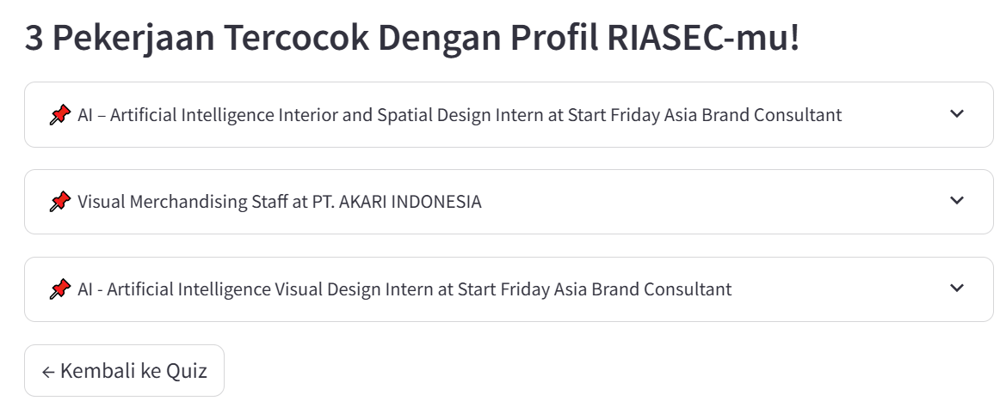
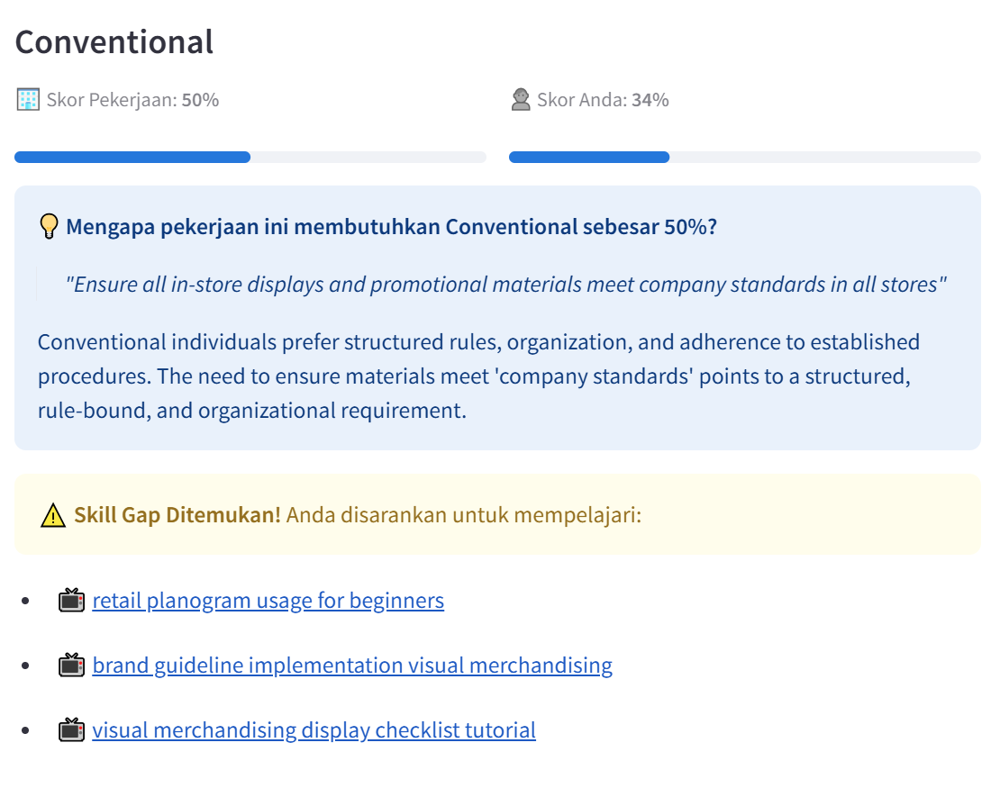

# Search Jobs & Analyze Skill Gaps Based on RIASEC Traits

This is a web application designed to provide job vacancy recommendations sourced from Petra's alumni website (https://alumni.petra.ac.id/) and analyze the gaps between a user's RIASEC traits and a job's description or requirements. It further suggests educational videos to help bridge those gaps.

Under the hood, the application utilizes two core agents:

1. Rating Agent: Analyzes the job title, description, and requirements to assign a 0-10 score for each of the six RIASEC traits. It provides reasoning by highlighting which specific job description or requirement supports a given trait. This analysis is supported by a summarized RIASEC reference document generated via a QueryEngine.

2. Keyword Generation Agent: Takes the user's score, the job's score, and the reasoning provided by the Rating Agent to generate targeted keywords for finding educational videos.

Furthermore, the actual job matching is not performed directly by the LLM. Instead, it calculates the cosine similarity between the Rating Agent's job scores and the user's scores to ensure robust matching. A "skill gap" is identified when a job's requirement rating is above 50% (5/10) and the difference between the job's score and the user's score exceeds 10%.

## Some Examples

#### Case 1: User is strong in Investigative, Social, and Conventional

The job retrieved:

An example of the gap identified & video suggestions:

#### Case 2: User is strong in Artistic, Realistic, and Enterprising

The job retrieved:

An example of the gap identified & video suggestions:

